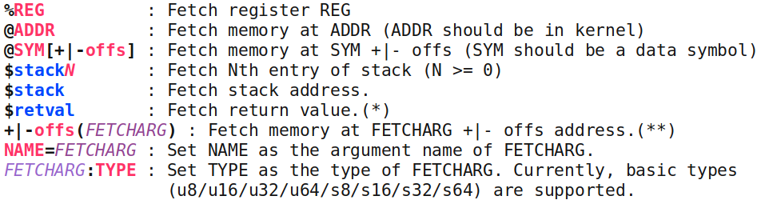
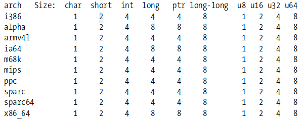
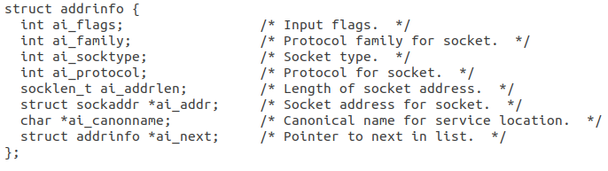
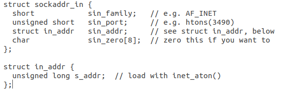
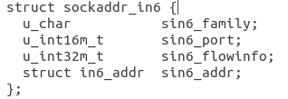
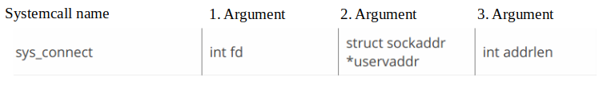
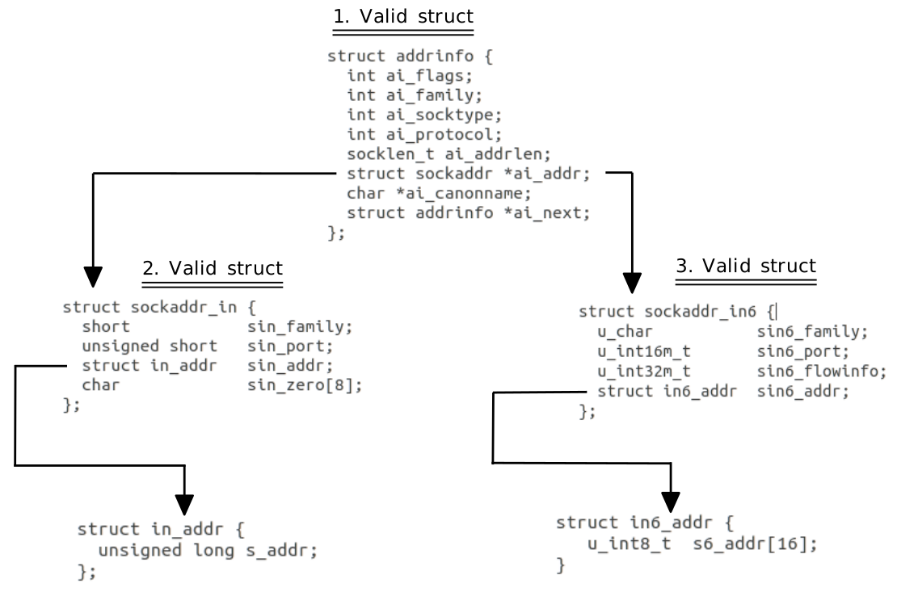

.. |br| raw:: html

    

.. |w| raw:: html

   &nbsp;

.. |us| raw:: html

	<u>

.. |ue| raw:: html

	</u>

=======
kprobes
=======

Overview
========

Ftrace is an internal tracer designed to help out developers and designers of systems to find out what is going on inside the kernel. It can be used for debugging or analyzing latencies and performance issues that take place outside of user-space.

Although ftrace is typically considered the function tracer, it is really a frame work of several assorted tracing utilities. There's latency tracing to examine what occurs between interrupts disabled and enabled, as well as for preemption and from a time a task is woken to the task is actually scheduled in.

.. note:: Before you continue reading, please have a look at the following links: |br|
	- `Key files in ftrace <./kerneldoc/ftrace.html#key-files>`_ (only read the bold marked files) |br|
	- `Trace pipe <./kerneldoc/ftrace.html#trace-pipe>`_ |br|
	- `Kprobes Events <./kerneldoc/kprobetrace.html#synopsis-of-kprobe-events>`_

debugfs
=======

What is a virtual file system?
******************************

A Virtual File System (VFS) is an abstraction layer on top of a more concrete file system that only exists during runtime. The purpose of a VFS is to allow client applications to access different types of concrete file systems in a uniform way. A VFS can, for example, be used to access local and network storage devices transparently without the client application noticing the difference. It can be used to bridge the differences in Windows, classic Mac OS/macOS and Unix filesystems, so that applications can access files on local file systems of those types without having to know what type of file system they are accessing.

What is debugfs?
****************

Debugfs is typically mounted in /sys/kernel/debug (also ftrace is located there). It is meant to be an aid for kernel developers to make information available to user space, this special file system is available in the Linux kernel since version 2.6.10-rc3. |br| Unlike /proc, which is only meant for information about a process, or sysfs, which has strict one-value-per-file rules, debugfs has no rules at all.  Developers can put any information they want there. Debugfs is not a mandatory part of any kernel installation, and nothing found therein should be considered to be a part of the stable user-space. It is, instead, a dumping ground where kernel developers can quickly export information which is useful to them.

tracing
=======

.. important::
	You have to execute the following commands as user *root*.

**Check if ftrace is enabled**

To check if ftrace is enabled you have to display the content of the file |br| /proc/sys/kernel/ftrace_enabled. In the following example i am doing that by using the command *cat*, but you can also open the file with an editor and look at the content.

::

 cat /proc/sys/kernel/ftrace_enabled

.. line-block::

    enabled = 1
    disabled = 0

**Starting tracing**

To start tracing with ftrace you have to modify the file /sys/kernel/debug/tracing/tracing_on. When you want to start tracing you have to write *1* into the file. In the following example i am using the command *echo* to write into that file, but you can also do that with a normal editor.

::

 echo 1 > /sys/kernel/debug/tracing/tracing_on

**Turn off tracing**

When you want to stop tracing, you have to write *0* into the file /sys/kernel/debug/tracing/tracing_on.

::

 echo 0 > /sys/kernel/debug/tracing/tracing_on

kprobes
=======

With kprobes you are defining which systemcalls you want to monitor with ftrace.

**Define a kprobe**

|us| Example kprobe:|ue| |w| p:kprobe_name systemcall %register1 %register2 %register3

- **kprobe and kretprobe**
	o p:  |w| Set a probe |br|
	o r:  |w| Set a return probe |br|
	o -:  |w| Clear a probe |br|
- **kprobe_name**
	o Here you are defining the name of your kprobe, you can choose that name individually. |br|
- **systemcall**
	o Here you wirte the systemcall you want to monitor. |br|
	o To find most of the systemcalls that are avaliable visit this `website <http://blog.rchapman.org/posts/Linux_System_Call_Table_for_x86_64/>`_. |br|
- **register**
	o Here you write the registers you want to print out when a systemcall gets monitored. |br|
	o To see which registers are avaliable have a look at this `website <http://blog.rchapman.org/posts/Linux_System_Call_Table_for_x86_64/>`_. |br|

.. important::
	When writing kprobes, you have to specify every register without the *r* at the beginning, |br|
	e.g. Registername=rdi --> kprobename=di

**Select more specific information**

In the previous section i explained how to get the information out of one or more registers, but if you want to have more specific information from the kernel space you have to add some more parameters. (Image is from this `PowerPoint <https://events.static.linuxfound.org/slides/lfcs2010_hiramatsu.pdf>`_ - foil 9)

This image shows which other parameters in a kprobe are possible too. |br|
Example: |w| p:kprobe_name systemcall %register1 @address name=%register2 $stack

|us| Offset: |ue| |br|
You can specify an offset in byte. You can do that for example with: *+10(%bp)* |br|
Here you defining that you want to read the register bp, but you skip the first 10 bytes reading. |br|

|us| Datatypes in the Kernel: |ue| |br|
Because every architekture has it's different datatype lengths, we have to use standardised datatypes. (Image is from this `PDF <https://static.lwn.net/images/pdf/LDD3/ch11.pdf>`_) |br|

In the picture above we can see that the datatypes u8, u16, u32 and u64 have the same length on every architekture. Because these datatypes have the same length on every processor, we do only use these datatypes and the datatype string in ftrace.  |br|
For example, if you want to read a long variable on a x86_64 architekture, you first look how many bytes the datatype has on that architekture and take the appropriate standardised datatype, in this case this would be u64.

|us| Example: |ue| |br|
'foo=+10(%bp):u32' |w| --> |w| fetch u32 value from the address which bp register value plus 10

**Get the output if a kprobe matches**

When a kprobe matches, the information gets written into a pipe called *trace_pipe*. You can readout that information with the command: ::

 cat -v trace_pipe

**Add a new kprobe**

To add a new kprobe you have to write the kprobe into the file /sys/kernel/debug/tracing/kprobe_events. Just add a new line in the file and paste your kprobe into it. In the following example i am doing this with the command *echo*, but you can also do that with a normal editor.

::

 echo 'p:kprobe_name systemcall %registers' >> /sys/kernel/debug/tracing/kprobe_events

**Enable a kprobe**

To enable a kprobe you have to write *1* into the file /sys/kernel/debug/tracing/events/kprobes/NAME_OF_KPRBE/enable. In the following example i am using the command *echo* to do that, but you can also use a normal editor.

::

 echo 1 > /sys/kernel/debug/tracing/events/kprobes/NAME_OF_KPRBE/enable

**Delete all kprobes**

To delete all kprobes you have to erase the content of the file /sys/kernel/debug/tracing/kprobe_events. In the following example i am doing that with the command *echo*, but you can also use an editor to delete the content of the file.

::

 echo > /sys/kernel/debug/tracing/kprobe_events

.. caution::
	When you delete all kprobes, you have to be sure that all kprobes are disabled, otherwise you won't be able to delete them. |br| The error you get, when you don't disable the kprobes first, looks like this: |br|
	*-bash: /sys/kernel/debug/tracing/kprobe_events: Device or resource busy*

kprobe example 1 - setuid
*************************

In example one we will have a look at the systemcall *setuid*. To create a new kprobe for the systemcall setuid you have to execute the following command: ::

 echo 'p:syssetuid sys_setuid %di:u32' >> /sys/kernel/debug/tracing/kprobe_events

- **p:syssetuid** -> Tells ftrace to create a new kprobe with the name syssetuid. The name of the kprobe can be choosen individually.
- **sys_setuid**  -> Specifies which systemcall you want to monitor with this kprobe, in this case the systemcall sys_setuid.
- **%di**         -> Specifies which registers should be printed out if the systemcall occurs.
- **:u32**		   -> Specifies how many bits should be read.
- **%di:u32**	   -> Print out the first 32 bits of the *di* Register.

.. caution:: After you added a new kprobe you have to enable it first, because every new added kprobe is disabled by default.

To enable a kprobe after you added it you have to set the file *enable* for the specific kprobe to "1". The following example is activating the kprobe for syssetuid: ::

 echo 1 > /sys/kernel/debug/tracing/events/kprobes/syssetuid/enable

Example output if the kprobe syssetuid matches: ::

 sudo-2125  [001] .... 346939.595312: syssetuid: (SyS_setuid+0x0/0x100) arg1=0

kprobe example 2 - execve
*************************

In example two we will have a look at the systemcall *execve*. To create a new kprobe for the systemcall execve you have to execute the following command: ::

 echo 'p:sysexecve sys_execve %di:string %si:string +8(%si):string' >> /sys/kernel/debug/tracing/kprobe_events

- **p:sysexecve** -> Tells ftrace to create a new kprobe with the name sysexecve. The name of the kprobe can be choosen individually.
- **sys_execve**  -> Specifies which systemcall you want to monitor with this kprobe, in this case the systemcall sys_execve.
- **%di:string**  -> Print out the content of the register di and interprete this as a string.
- **%si:string**  -> Print out the content of the register si and interprete this as a string.
- **+8(%si):string**	   -> Takes the address that is stored in the register si and adds up an offset of 8 bytes, then interpret the following bits as a string.

To enable the kprobe sysexecve you have to execute the following command: ::

 echo 1 > /sys/kernel/debug/tracing/events/kprobes/sysexecve/enable

Example output if the kprobe sysexecve matches: ::

 bash-2125  [001] .... 346939.589187: sysexecve: (SyS_execve+0x0/0x40) arg1="/usr/bin/sudo" arg2="sudo" arg3="ls"

kprobe example 3 - connect
**************************

To understand the following command we will go a bit more into detail. When the systemcall connect is called it gets passed three parameters: int fd, struct sockaddr \*uservaddr, int addrlen. These parameters are passed with registers, more specific with the registers di, si, dx.

- Register *di* stores = int fd
- Register *si* stores = struct sockaddr \*uservaddr
- Register *dx* stores = int addrlen

The *si* register provides us the base address of the struct that was passed with the systemcall.
When we want to find out the destination IP address of the connect systemcall we have to look deeper into one of the following structures:

- |us| struct addrinfo |ue|

- |us| struct sockaddr_in |ue|

- |us| struct sockaddr_in6 |ue|

All the three structs are valid parameters for the systemcall connect. The Problem is, we don't know which one of these three structs was used when the systemcall connect got called. Because of this we have to figure out which of these structs was used.
How to find out which of these three structs was used, will be explained later. (`Systemcall with IPv4 and IPv6 <./ftrace_kprobes_connect.html#systemcall-connect-with-ipv4-and-ipv6>`_)

In the following table are the datatypes byte lengths for the different architectures, you need the correct byte length of a datatype to calculate the correct offset.

To get the IP address, we have to read either the variable

- *struct sockaddr *ai_addr* in the struct *addrinfo* (addrinfo == sockaddr_in == sockaddr_in6)

- *s6_addr* in the struct *in6_addr* (Included in sockaddr_in6)

- *s_addr* in the struct *in_addr* (Included in sockaddr_in)

To get there we have to figure out which offset we need, to get to the base address of the variable we need.

Calculating the offset for a x86_64 architekture
************************************************
.. caution::
	The following examples are all assuming that during the systemcall the struct scokaddr_in was used.

**IP address**

If we want to get to the base address of the variable s_addr (where the IP address is stored) we have to add an offset of two short datatypes. In the x86_64 architekture short is two bytes long. So we have to add 4 bytes (2 * 2 byte(short)). The IP address has the datatype long which is 8 bytes long in x86_64. (8 byte = u64)

::

 addr=+4(%si):u64

So in order to get the variable s_addr we have to take the base address from the *si* register (base address of the struct sockaddr_in) and add an offset of 4 bytes to that address. Then we read 8 bytes (u64) starting from that offset address.

.. caution::
	The 8 bytes you get printed out are in network byte order. To see the IP address in numbers-and-dots notation you have to convert the 8 bytes first. (network byte order -> numbers-and-dots notation)

**Port**

If we want to get the base address of the variable sin_port we have to add an offset of the datatype short. In the x86_64 architekture short is two bytes long. So we have to add up 2 bytes offset. Then we read 2 bytes (u16) starting from that offset address. (sin_port is 2 bytes long)

::

 port=+2(%si):u16

.. caution::
	The 2 bytes you get back from ftrace are in network byte order. To see the port you have to convert the 2 bytes first. (network byte order -> numbers notation)

**Explanation of the kprobe connect** ::

 echo 'p:sysconnect sys_connect addr=+4(%si):u64 port=+2(%si):u16' >> /sys/kernel/debug/tracing/kprobe_events

- **p:sysconnect** -> Tells ftrace to create a new kprobe with the name sysconnect. The name of the kprobe can be choosen individually.
- **sys_connect**  -> Specifies which systemcall you want to monitor with this kprobe, in this case the systemcall sys_connect.
- **addr=+4(%si):u64**  -> Take the address that is stored in the register si and adds up an offset of 4 bytes, then print the following 64 bits and interpret it as unsigned integer.
- **port=+2(%si):u16**	   ->  Takes the address that is stored in the register si and adds up an offset of 2 bytes, then print the following 16 bit and interpret it as unsigned integer.

**Example output if the kprobe connect matches:** ::

  a.out-5457  [001] .... 16189.671371: sysconnect: (SyS_connect+0x0/0x10) addr=555487404 port=35876

IP address in network byte order: 555487404 |br|
Port in network byte order: 35876

**Convert from network byte order into host byte order:** |br|

You can convert the IP address from network byte order into host byte order with this python3 function: ::

 import ipaddress
 import struct
 def int2ip(input):
   new_int = struct.unpack("<L", input.to_bytes((input.bit_length() + 7) // 8, 'big'))[0]	#big endian to little endian
   return str(ipaddress.IPv4Address(new_int))

You can convert the port from network byte order into host byte order with this python function: ::

 socket.htons(PORT)

**Example conversions:** |br|

>>> int2ip(555487404)
'172.16.28.33'

>>> socket.htons(35876)
9356

Monitor IPv4 and IPv6 connections with the systemcall connect
*************************************************************

When you want to call the systemcall connect, you have to pass three arguments to the systemcall. The second argument can either be a struct of the type addrinfo, sockaddr_in or sockaddr_in6. |br|

|br|

**x86_64 specific datatype lengths:**

.. code-block:: python

	socklen_t:		unsigned int (4 byte)
	u_int8_t:		1 byte
	u_int16m_t:		2 byte
	u_int32m_t:		4 byte

**Supported address families:**

.. code-block:: python

	#define AF_UNSPEC		0
	#define AF_UNIX			1		/* Unix domain sockets 	*/
	#define AF_INET			2		/* Internet IP Protocol */
	#define AF_AX25			3		/* Amateur Radio AX.25 	*/
	#define AF_IPX			4		/* Novell IPX 		*/
	#define AF_APPLETALK		5		/* Appletalk DDP 	*/
	#define	AF_NETROM		6		/* Amateur radio NetROM */
	#define AF_BRIDGE		7		/* Multiprotocol bridge */
	#define AF_AAL5			8		/* Reserved for Werner's ATM 	*/
	#define AF_X25			9		/* Reserved for X.25 project 	*/
	#define AF_INET6		10		/* IP version 6			*/
	#define AF_MAX			12		/* For now.. */

**Supported socket types:**

.. code-block:: python

	#define SOCK_STREAM	1		/* stream (connection) socket	*/
	#define SOCK_DGRAM	2		/* datagram (conn.less) socket	*/
	#define SOCK_RAW	3		/* raw socket		*/
	#define SOCK_RDM	4		/* reliably-delivered message	*/
	#define SOCK_SEQPACKET	5		/* sequential packet socket	*/
	#define SOCK_PACKET	10		/* linux specific way	*/

**Kprobe for systemcall connect:**

::

 echo 'p:connect_track sys_connect info_family=+4(%si):s32 info_socktype=+8(%si):s32 info_ipv4=+24(%si):u32 info_ipv6_1=+28(%si):u64 ipv6_info_2=+36(%si):u64 info_port=+22(%si):u16 sock_ipv4=+4(%si):u32 sock_ipv6_1=+8(%si):u64 sock_ipv6_2=+16(%si):u64 sock_family=+0(%si):s16 sock_port=+2(%si):u32' >> /sys/kernel/debug/tracing/kprobe_events

- **echo 'p:connect_track sys_connect** 	-> defines and sets the name for the kprobe
- **info_family=+4(%si):s32**	 	-> reads ai_family from the struct infoaddr
- **info_socktype=+8(%si):s32** 		-> reads ai_socktype from the struct infoaddr
- **info_ipv4=+24(%si):u32** 		-> reads s_addr from the struct in_addr |br| (infoaddr -> sockaddr_in -> in_addr)
- **info_ipv6_1=+28(%si):u64** 		-> reads the first part of the IPv6 address from the struct in6_addr |br| (infoaddr -> sockaddr_in6 -> in6_addr)
- **ipv6_info_2=+36(%si):u64** 		-> reads the second part of the IPv6 address from the struct in6_addr |br| (infoaddr -> sockaddr_in6 -> in6_addr)
- **info_port=+22(%si):u16** 		-> reads sin_port from the struct sockaddr_in or sockaddr_in6 |br| (depends on which struct was used when the systemcall got called)
- **sock_ipv4=+4(%si):u32** 		-> reads s_addr from the struct in_addr |br| (sockaddr_in -> in_addr)
- **sock_ipv6_1=+8(%si):u64** 		-> reads the frist 64 bit from the struct in6_addr |br| (sockaddr_in6 -> in6_addr)
- **sock_ipv6_2=+16(%si):u64** 		-> reads the second 64 bit from the struct in6_addr |br| (sockaddr_in6 -> in6_addr)
- **sock_family=+0(%si):s16** 					 -> reads sin_family from the struct sockaddr_in
- **sock_port=+2(%si):u32'**					 -> reads sin_port from the struct sockaddr_in
- **>> /sys/kernel/debug/tracing/kprobe_events** -> writes the kprobe

**Example output of the kprobe sys_connect:**

::

 ping6-15504 [001] .... 17494.061120: connect_track: (SyS_connect+0x0/0x10) info_family=0 info_socktype=33022 info_ipv4=2 info_ipv6_1=4179340497149493248 ipv6_info_2=141828410048512 info_port=59565 sock_ipv4=0 sock_ipv6_1=33022 sock_ipv6_2=16766106286880147346 sock_family=10 sock_port=260

**How to evaluate which struct was passed with the systemcall connect:**

.. code-block:: python

 if info_family == 2, 10 && info_socktype == 1, 2, 3:
 	if info_family == 2:
 		--> struct *addrinfo* with IPv4
 	if info_family == 10:
 		--> struct *addrinfo* with IPv6
 else
 	if sock_family == 2:
 		--> struct *sockaddr_in* with IPv4
 	if sock_family == 10:
 		--> struct *sockaddr_in6* with IPv6

See also the code from the Repository kernel_tracing (Module ip_conversion): `kernel_tracing <https://192.168.99.29/Linux/kernel_dev/kernel_tracing/blob/master/processwatchdog/ip_conversion.py>`_

**Example evaluation:**

::

 info_family=0
 info_socktype=33022
 sock_family=10

 --> struct *sockaddr_in6* with IPv6

 Information we need:
 sock_ipv6_1=33022
 sock_ipv6_2=16766106286880147346

**How to convert the two integers into an IPv6 address:**

::

 1. Convert sock_ipv6_1 and sock_ipv6_2 to binary:

 sock_ipv6_1=33022 -> 0000000000000000000000000000000000000000000000001000000011111110
 sock_ipv6_2=16766106286880147346 -> 1110100010101101001011001101011001010111111011110100011110010010

 2. Split binary string to 8 bit packages
                                                                    |   1  |  |   2  |  |   3  |  |   4  |  |   5  |  |   6  |  |   7  |  |   8  |
 0000000000000000000000000000000000000000000000001000000011111110 = 00000000  00000000  00000000  00000000  00000000  00000000  10000000  11111110
 1110100010101101001011001101011001010111111011110100011110010010 = 11101000  10101101  00101100  11010110  01010111  11101111  01000111  10010010

 3. Invert byte order of the binary string

 |   1  |  |   2  |  |   3  |  |   4  |  |   5  |  |   6  |  |   7  |  |   8  |
 00000000  00000000  00000000  00000000  00000000  00000000  10000000  11111110
 convert to:
 |   8  |  |   7  |  |   6  |  |   5  |  |   4  |  |   3  |  |   2  |  |   1  |
 11111110  10000000  00000000  00000000  00000000  00000000  00000000  00000000

 |   1  |  |   2  |  |   3  |  |   4  |  |   5  |  |   6  |  |   7  |  |   8  |
 11101000  10101101  00101100  11010110  01010111  11101111  01000111  10010010
 convert to:
 |   8  |  |   7  |  |   6  |  |   5  |  |   4  |  |   3  |  |   2  |  |   1  |
 10010010  01000111  11101111  01010111  11010110  00101100  10101101  11101000

 4. Concatenate the two reordered binary strings
 11111110  10000000  00000000  00000000  00000000  00000000  00000000  00000000 && 10010010  01000111  11101111  01010111  11010110  00101100  10101101  11101000
 11111110100000000000000000000000000000000000000000000000000000001001001001000111111011110101011111010110001011001010110111101000

 5. Convert binary string to hex
 bin = 11111110100000000000000000000000000000000000000000000000000000001001001001000111111011110101011111010110001011001010110111101000
 --> hex = FE800000000000009247EF57D62CADE8

 6. Convert hey string to an IPv6 address
 hex = FE800000000000009247EF57D62CADE8
 --> IPv6 = fe80::9247:ef57:d62c:ade8

**Python function to convert the two integers into an IPv6 address:**

.. code-block:: python

 import ipaddress
 import sys
 import socket
 import ipaddress

 def int2ipv6(self, input1, input2):
        bin_ipv6_1 = '{0:064b}'.format(input1)
        bin_ipv6_2 = '{0:064b}'.format(input2)
        try:
            part1 = self.orderIPv6(bin_ipv6_1)
            part2 = self.orderIPv6(bin_ipv6_2)
            conv_bin = str(part1) + str(part2)
            conv_int = int(conv_bin, 2)
            return str(ipaddress.IPv6Address(conv_int))
        except:
            return -1

 def orderIPv6(self, input):
    try:
        array = [input[i:i+8] for i in range(0, len(input), 8)]
        ret = ""
        for x in reversed(array):
            ret += x
        return ret
    except:
        return -1

**Example conversion with python functions:**

.. code-block:: python

 from connectionwatcher.modules.ip_conversion import IP_conversion

 sock_ipv6_1=33022
 sock_ipv6_2=16766106286880147346

 IP = IP_conversion()
 print("IPv6: {}".format(IP.int2ipv6(sock_ipv6_1, sock_ipv6_2)))

**Output:**

::

 IPv6: fe80::9247:ef57:d62c:ade8

Useful links
============

**general**

- https://www.kernel.org/doc/Documentation/trace/ (lot of ftrace documentation)
- http://blog.rchapman.org/posts/Linux_System_Call_Table_for_x86_64/  (systemcalls and parameters)
- https://www.cs.utexas.edu/~bismith/test/syscalls/syscalls.html (linux systemcalls in general)

**more specific**

- https://events.static.linuxfound.org/slides/lfcs2010_hiramatsu.pdf (kprobes)
- https://static.lwn.net/images/pdf/LDD3/ch11.pdf (datatypes in the kernel)
- https://www.gta.ufrj.br/ensino/eel878/sockets/sockaddr_inman.html (structs)

**sources**

- https://www.mjmwired.net/kernel/Documentation/filesystems/debugfs.txt (debugfs)
- https://lwn.net/Articles/309298/