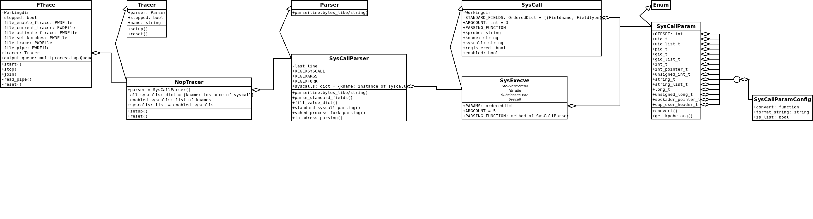

*********
Struktur
*********

`FTrace <./modules/ftrace.html#module-ftrace.ftrace>`_
==================================================================

Die Klasse FTrace stellt das Herzstück dieser Bibliothek dar.
Sie steuert das gleichnamige Kernelfeature FTrace an und ist für dessen ordnungsgemäße
Bedienung zuständig.
FTrace besitzt ein öffentliches Attibut:

* tracer:
  Der tracer muss eine Instanz einer Subklasse der Klasse Tracer sein.
  Ohne einen tracer lässt sich FTrace nicht starten. Ihn zu setzen sollte daher der
  erste Schritt in der Benutzung sein.
  Siehe Abschnitt `Tracer`_

Außerdem besitzt FTrace drei öffentliche Methoden:

* setup():
  Nach Aufruf dieser Methode werden alle nötigen
  vorbereitenden Maßnahmen getroffen, um Daten des Kernelfeatures lesen und parsen zu können.
* reset():
  Alle Veränderungen werden zurückgesetzt und der ursprüngliche Zustand wiederhergestellt.
* get_output():
  Liefert ein Generator-Object zurück, das die geparste Ausgabe von FTrace zurückgibt

`Tracer <./modules/ftrace.html#module-ftrace.tracers>`_
==================================================================

Die Klasse Tracer ist die Elternklasse aller tracer.
Ein tracer ist dafür zuständig, den entsprechenden tracer im Kernelfeature Ftrace zu aktivieren,
alle nötigen vorbereitenden Maßnahmen zu treffen, weiß welche Klasse für die Interpretation
dessen Ausgaben zuständig ist, und setzt bei Beendigung alles wieder zum Urzustand zurück.

Momentan ist nur ein einziger tracer verfügbar, nämlich der NopTracer.

NopTracer
-----------

Der NopTracer ermöglich es, SysCalls nachzuverfolgen.
Die Ausgabe ist ein dictionary mit Parametern und Informationen über den SysCall-Aufruf.

Jeder SysCall hat folgende Parameter:

* caller_name:
  gibt den Namen des executables an, das im aufrufenden Prozess ausgeführt wird
* caller_pid:
  gibt die PID des ausführenden Prozesses an
* timestamp:
  gibt den Zeitpunkt an, zu dem der SysCall aufgerufen wurde
* kname:
  gibt den eindeutigen Namen der KProbe an. Siehe Dokumentation von FTrace
* syscall:
  gibt den Namen des SysCalls an

Auf diese allgemeinen Paramter folgen SysCall-spezifische:

.. csv-table::
   :header: "SysCall", "Parameter 1", "Parameter 2", "Parameter 3"
   :widths: 15, 10, 10, 10

   "Sys_Execve", "filename", "argv"
   "Sched_Process_Fork", "called_name", "called_pid"
   "Sys_Setuid", "uid"
   "Sys_Exit", "error_code"
   "Sys_Exit_Group", "error_code"
   "Sys_Kill", "pid", "sig"
   "Sys_Ptrace", "request", "pid", "addr"
   "Sys_Setreuid", "ruid", "euid"
   "Sys_Connect", "addr"
   "Sys_Accept", "addr"
   "Sys_Setgid", "gid"
   "Sys_Personality", "personality"
   "Sys_Open", "filename", "flags", "mode"
   "Sys_Close", "fd"
   "Sys_Umask", "mask"
   "Sys_Tkill", "pid", "sig"

Die Eigenschaft "syscalls" gibt in Form einer Liste von Instanzen von SysCalls an,
welche SysCalls getracet werden sollen.

Nützliche Links:

  * `Beispiele <beispiele.html>`_
  * `SysCall-Klasse <modules/ftrace.html#module-ftrace.syscalls>`_
