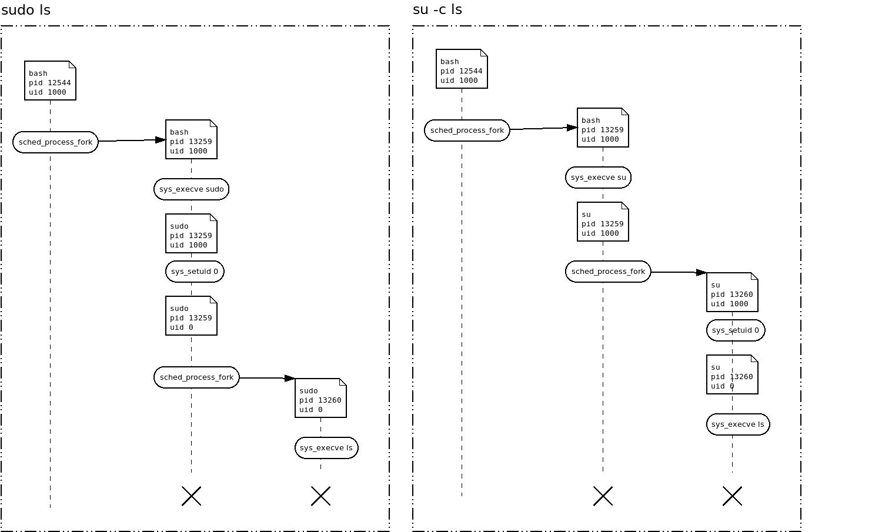

************
sudo vs. su
************

Die beiden Kommandi ``sudo`` und ``su`` haben beide eine sehr änliche Funktion:
Sie ermöglichen es einem Benutzer mit entsprechenden Rechten, ein Kommando
mit den Rechten eines anderen Benutzers (z.B. des superusers) auszuführen.
Anhand von ``sudo ls`` und ``su -c ls`` wollen wir uns aber den feinen Unterschied
auf SysCall-Ebene zwischen diesen beiden Programmen anschauen.

Hierzu bietet sich das erste `Codebeispiel <./beispiele.html#sys-execve-sys-setuid-und-sched-process-fork-loggen>`_
an, mit dem es möglich ist, SysCalls zu loggen. Es sollten in etwa folgende Ausgaben produziert werden:

``sudo ls``:

::

    {'caller_name': 'bash', 'caller_pid': 4588, 'timestamp': 6788.794592, 'kname': 'sched_process_fork', 'syscall': 'sched_process_fork', 'called_name': 'bash ', 'called_pid': 7291}
    {'caller_name': '<...>', 'caller_pid': 7291, 'timestamp': 6788.795131, 'kname': 'sys_execve_kprobe', 'syscall': 'SyS_execve', 'filename': '/usr/bin/sudo', 'argv': ['sudo', 'ls', '(fault)', '(fault)', '']}
    {'caller_name': 'sudo', 'caller_pid': 7291, 'timestamp': 6794.881823, 'kname': 'sys_setuid_kprobe', 'syscall': 'SyS_setuid', 'uid': 0}
    {'caller_name': 'sudo', 'caller_pid': 7291, 'timestamp': 6794.882534, 'kname': 'sched_process_fork', 'syscall': 'sched_process_fork', 'called_name': 'sudo ', 'called_pid': 7292}
    {'caller_name': 'sudo', 'caller_pid': 7292, 'timestamp': 6794.882801, 'kname': 'sys_execve_kprobe', 'syscall': 'SyS_execve', 'filename': '/bin/ls', 'argv': ['ls', '(fault)', '(fault)', '(fault)', '(fault)']}

``su -c ls``:

::

    {'caller_name': 'bash', 'caller_pid': 6417, 'timestamp': 17930.671995, 'kname': 'sched_process_fork', 'syscall': 'sched_process_fork', 'called_name': 'bash ', 'called_pid': 7354}
    {'caller_name': '<...>', 'caller_pid': 7354, 'timestamp': 17930.672434, 'kname': 'sys_execve_kprobe', 'syscall': 'SyS_execve', 'filename': '/bin/su', 'argv': ['su', '-c', 'ls', '(fault)', '(fault)']}
    {'caller_name': 'su', 'caller_pid': 7354, 'timestamp': 17933.521807, 'kname': 'sched_process_fork', 'syscall': 'sched_process_fork', 'called_name': 'su ', 'called_pid': 7355}
    {'caller_name': 'su', 'caller_pid': 7355, 'timestamp': 17933.521868, 'kname': 'sys_setuid_kprobe', 'syscall': 'SyS_setuid', 'uid': 0}
    {'caller_name': 'su', 'caller_pid': 7355, 'timestamp': 17933.523618, 'kname': 'sys_execve_kprobe', 'syscall': 'SyS_execve', 'filename': '/bin/ls', 'argv': ['ls', '(fault)', '(fault)', '(fault)', '(fault)']}

Wenn wir in der Bash mit der PID 12544 und der UID 1000 das Kommando ``sudo ls``
eingeben, wird unächst geforkt. Dadurch wird ein neuer Prozess geschaffen der
eine excakte Kopie des aufrufenden Prozesses ist - das einzige, was sich ändert,
ist die PID, z.B. auf 13259. In diesem Prozess wird nun der SysCall Sys_Execve aufgerufen
mit dem Paramter filename="/usr/bin/sudo", wodurch das Executable sudo gestartet wird. Das
macht sich für den Benutzer dadurch bemerkbar, dass sich der Name des Prozesses ändert.
Das Programm ``sudo`` ruft daraufhin den SysCall Sys_Setuid mit dem Parameter uid=0 auf. Dies
kann es nur, weil in dessen Berechtigungen (-rwsr-xr-x) das Set-uid-Flag (s) gesetzt ist.
Dadurch wird die effektive UID des Prozesses auf 0 gesetzt und hat somit auch entsprechende Rechte.
Der Prozess forkt daraufhin auf die PID 13260. Der neue Prozess erbt die UID 0 von dessen Parent und führt
daraufhin das Programm ``ls`` mit Root-Rechten aus. Nach dessen Beendigung terminiert

Der Unterschied zu ``su -c ls`` besteht nun in der Reihenfolge der SysCalls:
Während ``sudo`` zuerst die UID verändert und dann forkt, verhält sich ``su``
genau anders herum: es wird zuerst geforkt, dann die UID gesetzt.
